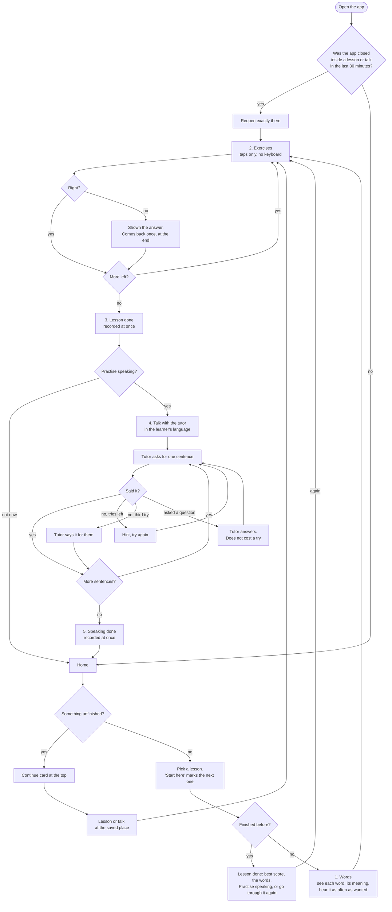

# How a learner moves through the app

Who this is for: a migrant worker in Singapore with little English, often little schooling, a cheap Android phone, and ten minutes between shifts. Three things follow from that, and every decision below comes back to one of them.

1. **They will be interrupted.** A supervisor, a phone call, the end of a break, or the phone closing the app to free memory. Nothing they have done may be lost to that.
2. **They may read very little, in any language.** What to do next is always one large button in view. Where a lesson stands is shown by a picture (a tick, a bar, a microphone) as well as words.
3. **They came for one real situation.** Somebody going to the clinic tomorrow needs the clinic lesson today. Nothing is ever locked; the app only suggests an order.

## The whole journey

## What each stage is for

| Stage | What the learner does | Why it is there |
|---|---|---|
| Words | Looks at each English word with its meaning in their language. Taps to hear it. Starts when ready. | The first question used to be about a word nobody had shown them. Guessing right teaches nothing; guessing wrong teaches that the app is a test. |
| Exercises | Eight to ten short tasks, all taps: choose a picture, match pairs, listen and choose, put words in order, pick a reply. | A keyboard is the biggest obstacle for this learner, so there is none. |
| Lesson done | Sees the sentences they can now say and one thing worth knowing in Singapore. One button leads on to speaking. | Ends on what they can do, not on a score. |
| Speaking | A tutor sets a scene in Bengali, Tamil or Hindi and asks for each sentence in turn. | The exercises teach what the words mean. This is where they get said. |
| Speaking done | Sees which sentences they said alone and which with help. | Help is shown as practice, never as failure. |

## When is speaking practice finished?

It is not open-ended. A talk has a fixed list of goals: the sentences and words the run just taught that have a meaning in the chosen language, usually three or four. The counter beside the progress bar (`2/4`) shows how far along it is.

Each goal ends in one of two ways, and the server decides which, not the model:

- **Said.** The recording is written down by a request that knows nothing about the lesson, then judged against the goal's key words.
- **Helped.** After the third miss the tutor says the English for them and moves on.

A question, or talk about something else, does not use a try, up to four times a goal. When the last goal ends, the talk ends, and it is recorded then, not when the results screen is closed. Rules: `apps/api/src/tutor.ts` (`decideOutcome`, `MAX_ATTEMPTS`, `MAX_ASIDES`).

## What is remembered, and where

| What | Where | For how long |
|---|---|---|
| Finished lessons: when, how many times, best first-try score, speaking result | The phone, and copied to the server | For good. A new phone gets it back on sign-in. |
| A lesson in progress: the queue, the position, each answer's record | The phone only | 14 days, or until the lesson's exercises change |
| A talk in progress: the words of each turn, the goal and try number | The phone only | 24 hours |
| The screen to reopen on | The phone only | 30 minutes, and cleared when the learner leaves by choice |

Nothing is saved "on exit", because on Android there often is no exit: the phone stops the app without telling it. Every answer and every tutor turn is written down as it happens.

What is deliberately not kept: the answer being built (an exercise comes back at its start), recordings (deleted once sent), and the tutor's voice files (a talk picked up later shows its earlier lines as text).

Leaving a lesson asks no "are you sure?". The place is kept, so leaving costs nothing, and a dialog is one more thing to read.

Two copies of a learner's progress are merged by taking, for each lesson, the latest date, the highest run count and the best result. Two results with the same share right (nine of nine against ten of ten, which is one lesson done in two languages) are settled by the larger total, never by which side is merging, or the phone and the server would each keep their own and swap them on every sync. Nothing is ever taken away, so it does not matter which phone syncs first. The rule is the same on the phone (`lib/progress/model.ts`) and on the server (`src/progress.ts`). Progress is kept per account, because a phone shared in a dormitory is common, and it is removed from both places when the account is deleted.

## Edge cases that are handled

- The phone closes the app mid-exercise, or mid-talk while a recording is being sent. The learner comes back to that exercise, or to that goal on the same try.
- The learner answers the last exercise and leaves on its feedback, without pressing Finish. The lesson is finished by its last answer, so it is recorded; it used to wait for the button, and they came back to do that exercise again.
- A finished lesson is opened again. It says it is done, with the best score and the words, and leaves going through it again as a choice. It does not open on its first question as if nothing had been kept.
- A finished lesson is being gone through again. It is still finished: its tick stays on Home and it still counts towards the lessons done, with the bar showing how far the new run has got.
- The learner changes their language part-way through a lesson. Their place and their answers stand. Only the exercises still ahead are chosen again: a translation exercise whose prompt would now fall back to English is dropped, one that has become possible is added at the end, and the score is out of what was actually queued.
- The lesson was edited, or yesterday's daily mix is no longer today's. The saved run is discarded and not offered as something to continue.
- A screen reader was switched on since the run was saved. The run held picture exercises it cannot do, so the lesson starts again.
- No connection. Lessons work fully. Finished lessons sync the next time there is one. Speaking says the tutor could not answer and keeps the recording for another try.
- The tutor service fails mid-talk. The recording is kept and Send is offered again.
- Two people use one phone. Each sees only their own progress.
- The stored file is unreadable or has been tampered with. Bad entries are dropped one by one; the app never fails to open over it.
- An account is deleted while another phone still holds progress. The server refuses the write, so nothing is written back.
